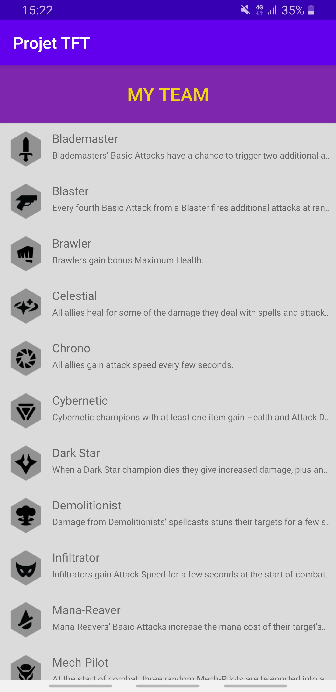
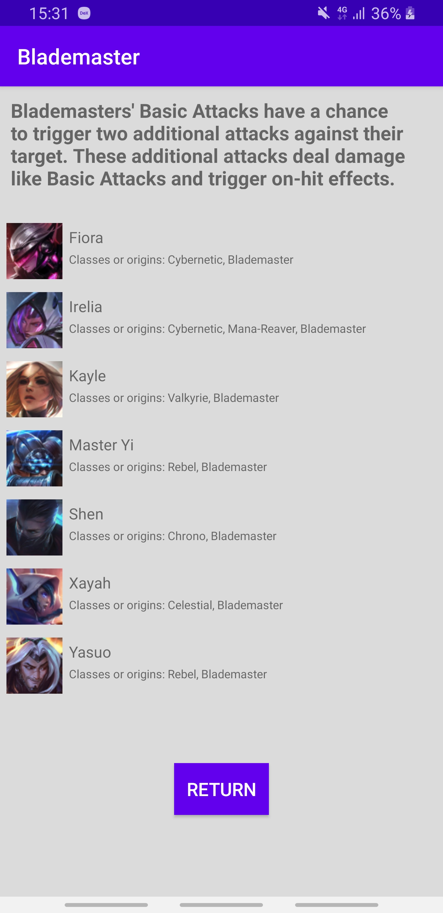
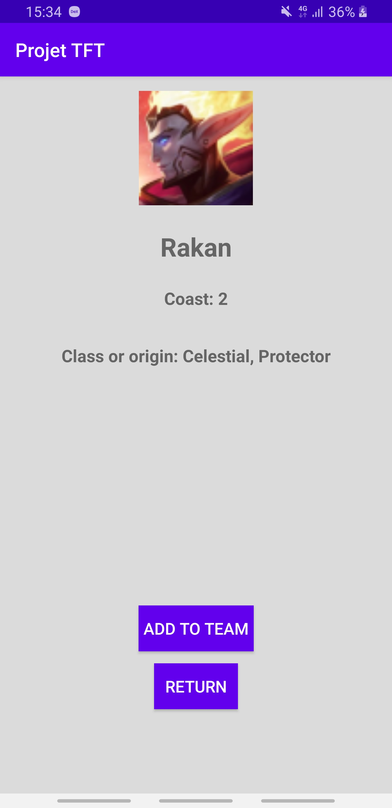

<h1>
  <i>Projet Android 3A - PROJET TFT</i>
</h1>
<h2>
  Présentation
</h2>

  Un petit projet mettant en avant les notions du développement mobile vue en cours sur AndroidStudio dans une application codé en Java. 
   
  Cette application affiche la liste des champions disponible sur le jeux Teamfight Tactics de Riot Games, trié par classes et/ou orignes.
  De plus, on peut créer et sauvegarder une équipe de 9 champions.
   
  Cette application utilise une API hébergé sur GitHub, elle contient toute les informations sur les champions, classes et origines.
   
  Lien de l'API : <a href="https://github.com/ChristianStephenn/Projet_Android/blob/master/TFTAPI.json">TFTApi</a>

<h2>
  Consignes respectées :
</h2>

  <ul>
    <li>Architecture : <ul> 
                           <li>Singleton</li> 
                           <li>Design Patterns</li>
                           <li>MVC</li> 
                           <li>Principe SOLID</li>
                       </ul>
    <li>Ecrans : 4 activités</li>
    <li>Appel WebService à une API Rest</li>
    <li>Stockage de données en cache</li>
    <li>Gitflow</li>
    <li>fonctionnalité : My Team</li>
  </ul>

<h2>
  Fonctionnalités :
</h2>
<h3>
  Écran d'accueil
</h3>
<ul><li>Affiche la liste des classes et origines</li></ul>

<h3>
  Écran de la liste des champions d'une classes ou origines
</h3>
<ul><li>Affiche la liste des classes et origines</li></ul>

   
  

<h3>
  Écran de la liste des champions d'une classes ou origines
</h3>
<ul><li>Affiche la description d'un champion</li></ul>

