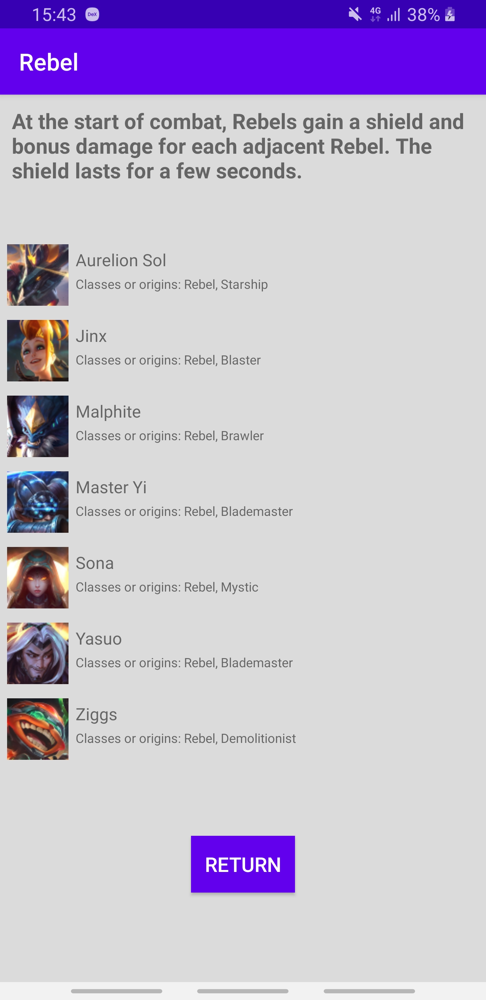
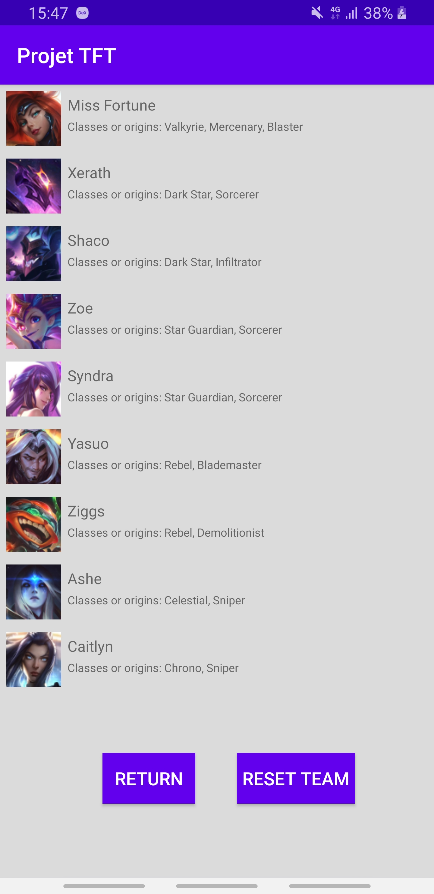

<h1>
  <i>Projet Android 3A - PROJET TFT</i>
</h1>
<h2>
  Présentation
</h2>

  Un petit projet mettant en avant les notions du développement mobile vu en cours sur Android Studio dans une application codée en Java. 
   
  Cette application affiche la liste des champions disponibles sur le jeu Teamfight Tactics de Riot Games, triées par classes et/ou origines.
  De plus, on peut créer et sauvegarder une équipe de 9 champions.
   
  Cette application utilise une API hébergé sur GitHub, elle contient toutes les informations sur les champions, classes et origines.
   
  Lien de l'API : <a href="https://github.com/ChristianStephenn/Projet_Android/blob/master/TFTAPI.json">TFTApi</a>

<h2>
  Consignes respectées :
</h2>

  <ul>
    <li>Architecture : <ul> 
                           <li>Singleton</li> 
                           <li>Design Patterns</li>
                           <li>MVC</li> 
                           <li>Principe SOLID</li>
                       </ul>
    <li>Ecrans : 4 activités</li>
    <li>Appel WebService à une API Rest</li>
    <li>Stockage de données en cache</li>
    <li>Gitflow</li>
    <li>fonctionnalité : My Team</li>
  </ul>

<h2>
  Fonctionnalités :
</h2>
<h3>
  Écran d'accueil
</h3>
<ul>
  <li>Affiche la liste des classes et origines</li>
  <li>Voir les champions de la classe ou origine en cliquant sur l'une d'elles</li>
</ul>

<h3>
  Écran de la liste des champions d'une classe ou origine
</h3>
<ul>
  <li>Affiche la liste des champions d'une classe ou origine</li>
  <li>Voir la description d'un des champions en cliquant sur l'une d'elles</li>
  <li>Bouton retour</li>
</ul>

   
  

<h3>
  Écran de la description d'un champion
</h3>
<ul>
  <li>Affiche la description d'un champion</li>
  <li>bouton permettant de l'ajouter à notre équipe</li>
  <li>Bouton retour</li>
</ul>

<h3>
  Écran de la liste des champions de votre équipe
</h3>
<ul>
  <li>Affiche la liste des champions de votre équipe</li>
  <li>bouton permettant de vider votre équipe</li>
  <li>supprimer un champion de votre équipe en cliquant sur l'une d'elles</li>
</ul>

